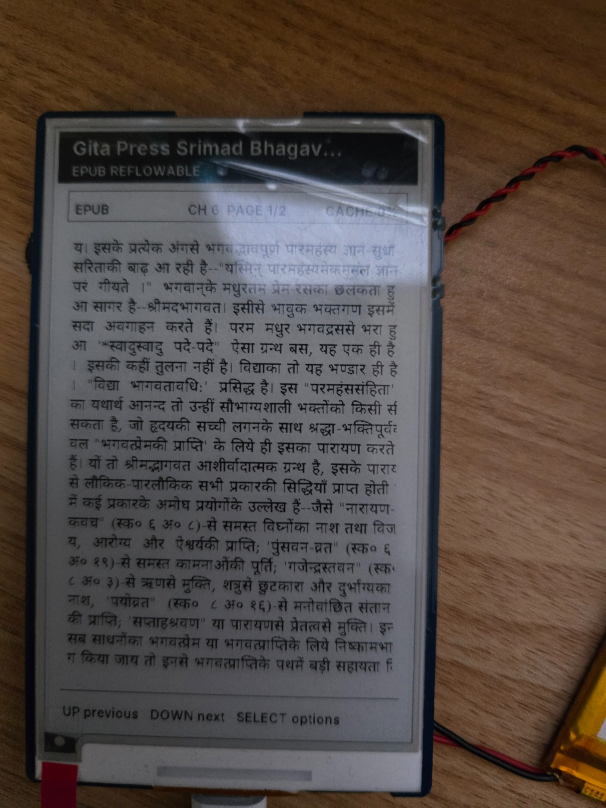
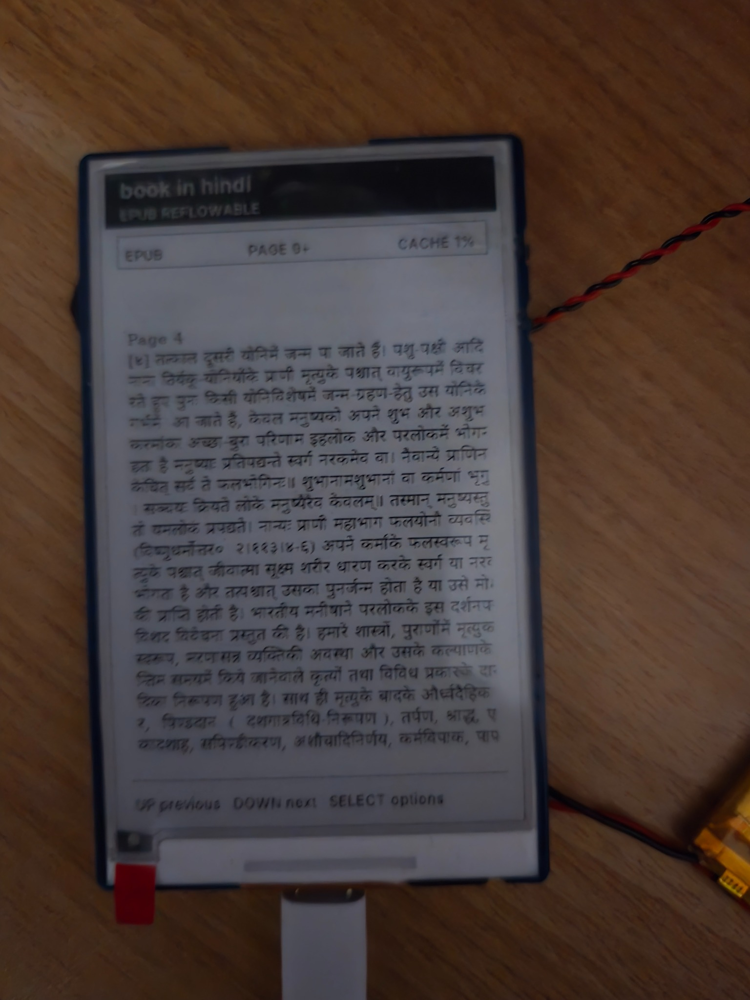
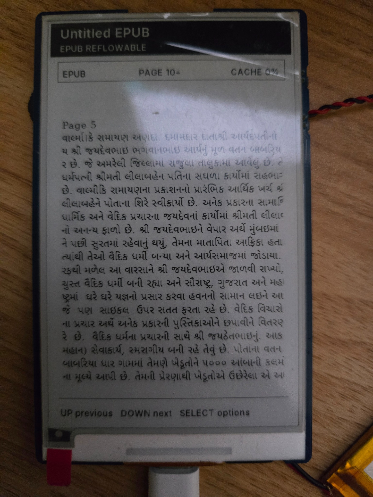

# Rustmix Wave screenshots

Rustmix Wave repository screenshots document physically verified UI behavior on the Waveshare ESP32-S3 3.97-inch e-paper board. The complete screen-by-screen operating guide is available at [`docs/USER_GUIDE.md`](docs/USER_GUIDE.md).

## v1.1.0 Indic EPUB rendering

Rustmix Wave v1.1.0 adds SD-generated Unicode cluster packs for **Noto Sans Devanagari Regular** and **Noto Sans Gujarati Regular**. The packs are generated locally with [`tools/font-builder/index.html`](tools/font-builder/index.html), installed under `/RUSTMIX/FONTS`, and streamed from SD as bounded visible-page glyph subsets.

### Devanagari: Hindi and Sanskrit Bhagavat EPUB

The large Bhagavat EPUB exercises the first-page-first, lazy-anchor Reader path for a large Hindi and Sanskrit archive.

### Devanagari: Hindi Garud Puran EPUB

This page demonstrates Devanagari matras, punctuation, and conjunct-heavy Hindi text using the SD-loaded Noto Sans Devanagari pack.

### Gujarati: Valmiki Ramayan EPUB

This page demonstrates Gujarati rendering using the SD-loaded Noto Sans Gujarati pack.

## Existing UI screenshots

The remaining repository screenshots cover the dashboard, Reader, Calendar, Voice Notes, Dictionary, utilities, settings, sensors, Wi-Fi transfer, games, and sleep-image mode. Browse the indexed reference in [`docs/USER_GUIDE.md`](docs/USER_GUIDE.md#8-screenshot-index) or the asset directory under [`screenshots/`](screenshots/).
